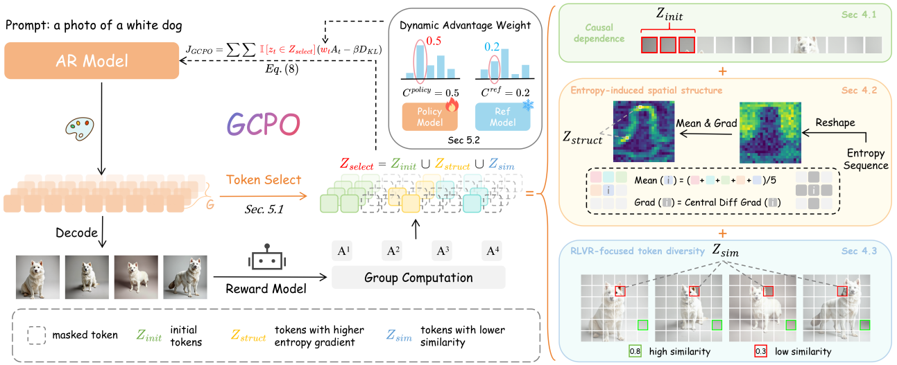
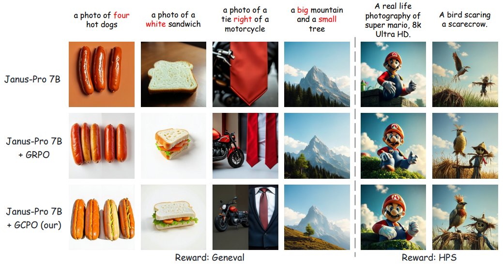
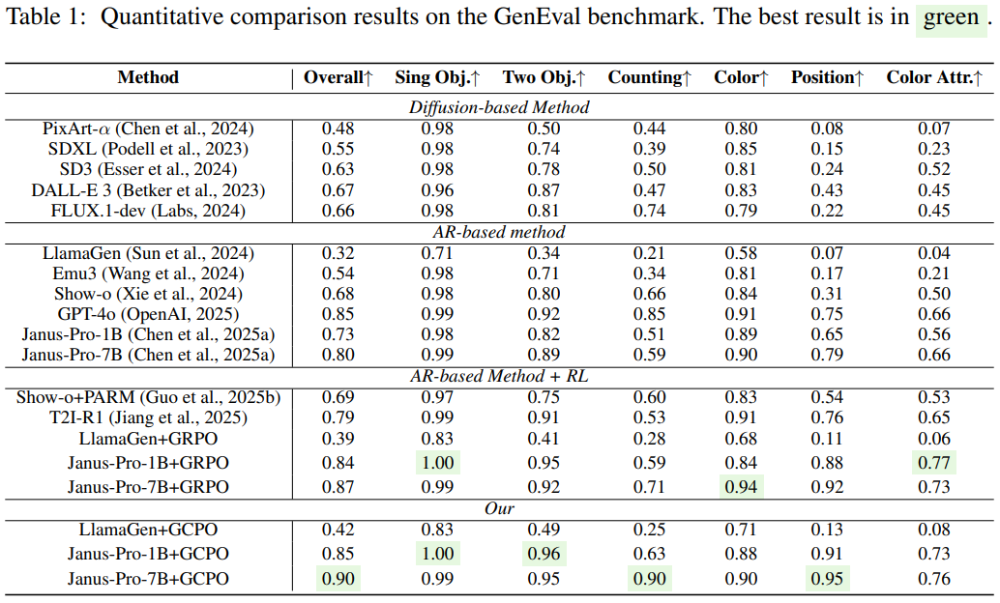
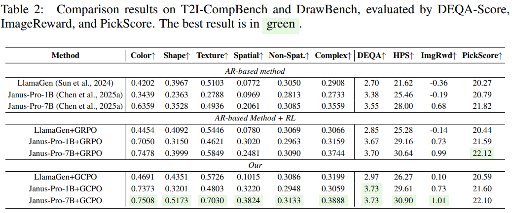

<div align="center">
    <h1 align="center"> GCPO: Group Critical-token Policy Optimization 
      for Autoregressive Image Generation
    </h1>
</div>
<div align="center">
    <a href="https://arxiv.org/abs/2509.22485">
        
    </a>&nbsp;
    <a href="https://huggingface.co/collections/zghhui/gcpo-68d6559a2ded31596c3841fe">
        
    </a>&nbsp;
    <a href="https://github.com/zghhui/GCPO">
        
    </a>
</div>

## 🔈 News
- [2025-09] All weights are avialable on [Huggingface](https://huggingface.co/collections/zghhui/gcpo-68d6559a2ded31596c3841fe)!
- [2025-09] Train and inference code are avialable
- [2025-09] GCPO is released on [Arixv](https://arxiv.org/abs/2509.22485).


## 🔍 Introduction
We propose a novel reinforcement learning framework, Group Critical-token Policy Optimization (GCPO), to achieve efficient policy optimization of critical tokens. We consider critical tokens from three perspectives: 
- Causal dependency
- Entropy-induced spatial structure
- RLVR-focused token diversity

We select **30%** of critical tokens from all tokens and combine them with Dynamic Advantage Weights to achieve precise optimization✌
<div style="text-align: center; width: 100%;">
    
</div>

We validate the effectiveness of GCPO on multiple models (**LlamaGen**, **Janus-Pro**) and text-to-image benchmarks (Geneval, T2I-CompBench, DrawBench). Notably, GCPO achieves **0.90** on Geneval built on the original Janus-Pro-7B, and has strong genvalidate the effectiveness of GCPO on multiple models (**LlamaGen**, **Janus-Pro**) and text-to-image benchmarks (Geneval, T2I-CompBench, DrawBench). Notably, GCPO achieves **0.90** on Geneval built on the original Janus-Pro-7B, and has strong generalization on T2I-CompBench.

<details><summary><b>CLICK for Detailed Results</b></summary>
Visualization Results
<div style="text-align: center; width: 100%;">
    
</div>

Geneval Results
<div style="text-align: center; width: 100%;">
    
</div>

T2I-CompBench Results
<div style="text-align: center; width: 100%;">
    
</div>
</details>

## 🤗 Model List
| Model          | Preference Alignment | GenEval          |
|:--------------:|:-------------------:|:----------------:|
| LlamaGen-T2I   | [🤗HPS](https://huggingface.co/zghhui/LlamaGen-T2I-GCPO)            |                  |
| Janus-Pro 1B   | [🤗HPS](https://huggingface.co/zghhui/Janus-Pro-1B-GCPO-HPS)            | [🤗Geneval](https://huggingface.co/zghhui/Janus-Pro-1B-GCPO-Geneval)     |
| Janus-Pro 7B   | [🤗HPS](https://huggingface.co/zghhui/Janus-Pro-7B-GCPO-HPS)            | [🤗Geneval](https://huggingface.co/zghhui/Janus-Pro-7B-GCPO-Geneval)     |


## 🔧 Environment SetUp
#### 1. Clone this repository and navigate to the folder:
```bash
git clone https://github.com/zghhui/GCPO.git
cd GCPO
```

#### 2. Install the training package:
We provide training codes for **LlamaGen** and **Janus-Pro**, and recommend installing the environments for each.

**For LlamaGen:**

```bash
conda create -n gcpo_llamagen python=3.10
conda activate gcpo_llamagen
pip install -r llamaGen/requirements.txt
```

**For Janus-Pro:**

```bash
conda create -n gcpo_janus python=3.10
conda activate gcpo_janus
pip install -r janus/requirements.txt
```

#### 3. Download Models
**For LlamaGen:**

```bash
huggingface-cli download zghhui/LlamaGen-T2I
huggingface-cli download google/flan-t5-xl
wget https://huggingface.co/peizesun/llamagen_t2i/resolve/main/vq_ds16_t2i.pt
```

**For Janus-Pro:**

```bash
huggingface-cli download deepseek-ai/Janus-Pro-1B
huggingface-cli download deepseek-ai/Janus-Pro-7B
```

**For HPS Reward:**

```bash
huggingface-cli xswu/HPSv2
```

**For Geneval Reward**: 

- Please according to the instructions in [Flow-GRPO](https://github.com/yifan123/flow_grpo?tab=readme-ov-file) and [reward-server](https://github.com/yifan123/reward-server).

## 🚀 Training GCPO

### LlamaGen

```bash
cd llamaGen/src
bash scripts/rl_gcpo_hps.sh
```
> [!Note]
>
> Remember to modify the t5_model path in `gcpo/llamaGen/simpar/model/llama_model.py` (line 1244)

### Janus-Pro

```bash
cd janus/src
bash scripts/run_gcpo_hps.sh
bash scripts/run_gcpo_geneval.sh
```
> [!Note]
>
> Please run geneval server before running geneval reward. The reward function is located in `utils/reward_geneval.py`, and the IP of server can be modified here.


## 💫 Inference
### LlamaGen
```bash
cd llamaGen
bash scripts/inference.sh
```

### Janus-Pro
```bash
cd janus/src
bash scripts/inference.sh
```


## 📧 Contact
If you have any comments or questions, please open a new issue.


## 🤗 Acknowledgments
Our training code is based on [T2I-R1](https://github.com/CaraJ7/T2I-R1), [SimpleAR](https://github.com/wdrink/SimpleAR), and [Flow-GRPO](https://github.com/yifan123/flow_grpo).

Thanks to all the contributors!

## ⭐ Citation
If you find GCPO useful for your research or projects, we would greatly appreciate it if you could cite the following paper:
```
@article{zhang2025group,
  title={Group Critical-token Policy Optimization for Autoregressive Image Generation},
  author={Zhang, Guohui and Yu, Hu and Ma, Xiaoxiao and Zhang, JingHao and Pan, Yaning and Yao, Mingde and Xiao, Jie and Huang, Linjiang and Zhao, Feng},
  journal={arXiv preprint arXiv:2509.22485},
  year={2025}
}
```
